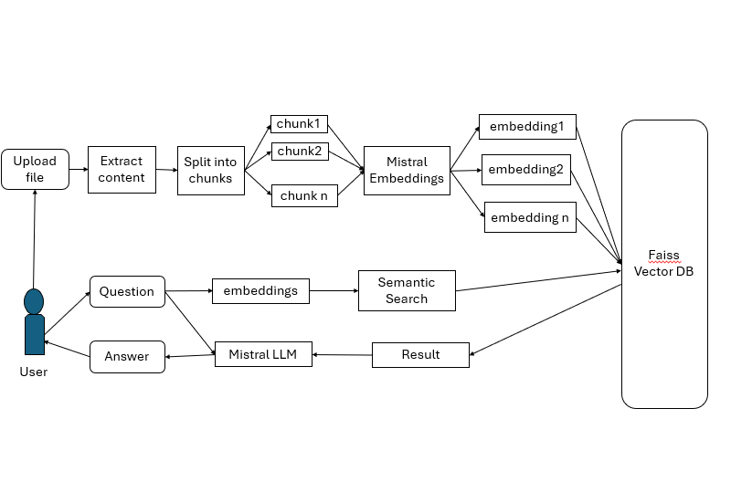

# Azones Chat with File

## Project Overview
This is a Django-based web application that allows users to upload files and chat with an AI-powered chatbot. The chatbot analyzes the uploaded file and responds to user queries based on the content of the file. Users can upload various file formats such as `.txt`, `.pdf`, `.csv`, `.xls`, `.xlsx`, `.md`, and `.docx`.


## Table of Contents

- [Introduction](#introduction)
- [Architecture Diagram](#architecture-diagram)
- [Features](#features)
- [Technology Stack](#technology-stack)
- [Installation](#installation)
- [Configuration](#configuration)
- [Usage](#usage)
- [File Structure](#file-structure)
- [Troubleshooting](#troubleshooting)


## Introduction

This project provides an AI-powered chatbot that interacts with users based on the content of uploaded files. Users can upload files in various formats (such as PDF, DOCX, CSV, etc.), and the chatbot will process and analyze the content to answer questions related to the file.

## Architecture Diagram

Below is an overview of the architecture of the Azones Chat with File:



### Explanation:
The flowchart depicts a system designed to handle both text input and file uploads. The primary goal is to process, store, and retrieve semantically meaningful information to answer user queries efficiently.

1. **Upload File**: Users can upload various file formats such as `.txt`, `.pdf`, `.csv`, `.xls`, `.xlsx`, `.md`, and `.docx`.

2. **Extract Content**: Extract text content from the file for processing

3. **Split into Chunks**: The text is split into smaller chunks for efficient processing.

4. **Mistral Embeddings**: These chunks are processed using the Mistral language model to generate embeddings (numerical representations of text).

5. **Pinecone Vector DB**: The embeddings are stored in the Pinecone vector database for high-speed similarity search.

6. **User Input**: The user asks the question related to the uploaded file.

7. **Semantic Search**: The user’s query is converted into embeddings, which are compared to stored embeddings to find the closest matches.

8. **Mistral LLM**: The most relevant text chunks are fed to the Mistral language model, generating answers to the user's query.

## Features

- Upload files in various formats (TXT, PDF, CSV, XLS, XLSX, MD, DOCX).

- Drag-and-drop file upload or browse functionality.

- Chatbot interaction based on file content.

- Real-time question answering and response from the AI chatbot.

- Option to download the chat history.

- Simple, user-friendly interface using Bootstrap for styling.


## Technology Stack

- **Backend**: Django (Python)
- **Frontend**: Bootstrap (HTML, CSS, JavaScript)
- **Vector Store**: Pinecone
- **LLM Model**: Mistral

## Installation

### Prerequisites

- Python 3.11
- Django 5.0.7
- Mistral AI Subscription

### Step-by-Step Guide

1. **Clone the Repository**:
   ```bash
   git clone https://github.com/AZONES-TECHNOLOGIES/Chat_with_File.git
   cd Chat_with_File
   ```

2. **Create a Virtual Environment**:
    ```bash
    python3 -m venv venv
   venv\Scripts\activate  # On Windows use 
    ```

3. **Install the Required Python Packages**:
    ```bash
    pip install -r requirements.txt
    ```

4. **Environment Variables**:
   - Create a `.env` file in the root directory.
   - Add the following environment variables:
    ```
    app=your_Mistral_api_key
    ```

5. **Navigate to the working directory**:
    ```bash
    cd chat     
    ```    

6. **Start the Development Server**:
    ```bash
    python manage.py runserver
    ```

## Configuration

- **Valid Document**: Upload the valid document format such as `.txt`, `.pdf`, `.csv`, `.xls`, `.xlsx`, `.md`, and `.docx`.
- **API Keys**: Ensure your Mistral API key is correctly set in the `.env` file.

## Usage

1. Navigate to the application in your browser:
- Open `http://127.0.0.1:8000` in your web browser.
2. Upload a file:
- Use the drag-and-drop area or browse button to upload your file.
3. Interact with the chatbot:
- After uploading, you will be redirected to the chatbot interface. Type your questions related to the file content and get responses.
4. Download chat history:
- Click the "Download Chat" button to save the conversation history.

## File Structure

```plaintext
Chat_with_File/
├── .env               # Environment variables
├── venv               # Virtual Environment
├── requirements.txt   # Python dependencies
├── README.md          # Project README
├── chat/
    │
    ├── app/                   # Main Django app
    │   ├── __pycache__/
    │   ├── migrations/
    │   ├── __init__.py
    │   ├── admin.py
    │   ├── apps.py
    │   ├── models.py
    │   ├── tests.py
    │   ├── urls.py
    │   ├── views.py            # Django views handling logic
    |   
    │
    ├── static/                 # Static files (CSS, JS, images)
    │   ├── images/
    │
    ├── templates/              # HTML template for the chatbot interface
    │   ├── base.html         
    │   ├── chat.html  
    │   ├── doc.html  
    │
    ├── chat/               
    │   ├── __pycache__/
    │   ├── __init__.py
    │   ├── asgi.py
    │   ├── settings.py
    │   ├── urls.py
    │   ├── wsgi.py         
    |
    ├── manage.py               # Django project management script
    └── ...
```
## Troubleshooting
**API Key Issues**: Ensure the API key and region are correctly set in the `.env` file.

**Valid Document**: Upload the valid document format such as `.txt`, `.pdf`, `.csv`, `.xls`, `.xlsx`, `.md`, and `.docx`.
